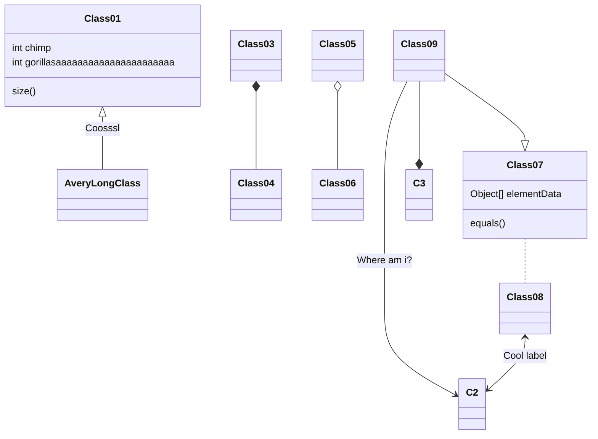
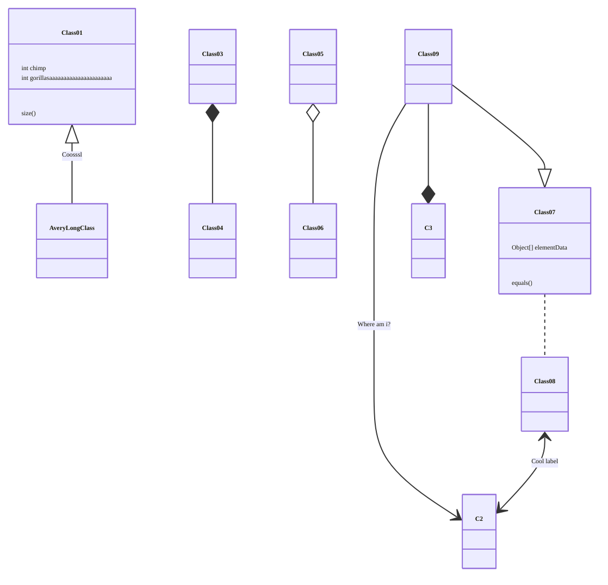
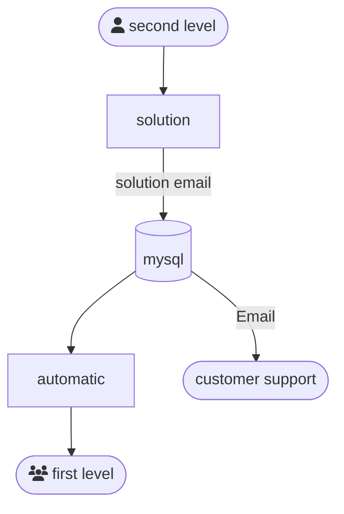
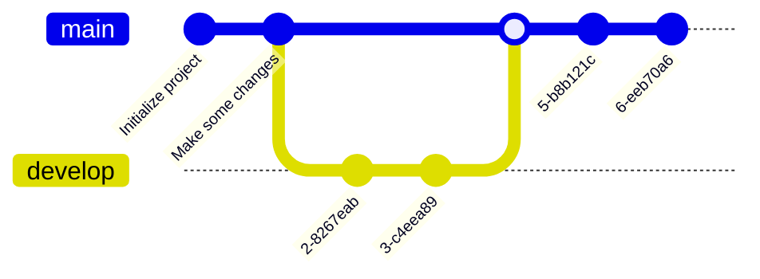

+++

title = "Guide for writing markdown slides"
description = "A Hugo theme for creating Reveal.js presentations"
outputs = ["Reveal"]
aliases = [
    "/guide/"
]

+++

[//]: # (Narrative)
[//]: # (HCI is about balancing usability, trying to mitigate complexity / and functionality, where we add complexity)
[//]: # (Graphical User Interfaces are usually the way to interact with a PC, so they got studied to improve usability,)
[//]: # (however studies are beiong conducted to interact with different methods... also mention AR and cite)
[//]: # (simulations usually goes with a Gui, also alchemist has one)
[//]: # (Interesting outcome of LLMs to solve problems... fast)
[//]: # (multiple way to do so: configure simulations, interact with simulaor ans simulations.)
[//]: # (introduction to alchemist and its story.)
[//]: # (alchemist started of with a cli, and gradually adapted to a desktop gui,)
[//]: # (and now to a web based gui. exlain what changes at every step.)
[//]: # (can we go beyond this?)
[//]: # (let's make a parallelism with the advent of copilot in idea.)
[//]: # (example of generation of fibonacci or whatever)
[//]: # (to create a simulation of alchemist you need to know... lot of stuff, )
[//]: # (the dream is to  create something from zero and gradually ask the llm to something?)
[//]: # (How? react is an example, lot of prossibilities, research for the future)

# Evolving the Interaction with Simulators
## Angelo Filaseta - angelo.filaseta@unibo.it

---

# A Simulation can be useful for a number of reasons

- Simulations are essential tools for *observing* complex systems and phenomena;
- They allow us to validate theories by comparing simulation outcomes with expected or real-world behavior;
- For this reason, *observability* is a critical aspect of simulations;

---

# Balance

- Human-Computer Interaction (HCI) focuses on the design, evaluation, and realization of interactive computing systems for human use.
- The effectiveness of a Human-Machine Interface (HMI) heavenly depends on factors that consider both __usability__ and __functionality__.

create a table where all the possibilites of scalabity and effectives presence of a gui are present, like + usability (easy to use even for non expert, but usually reduce the num,be rof functionalities) + functionality (can do a lot of stuff) 

| + Usability                                                         | + Functionality                                                  |
|---------------------------------------------------------------------|------------------------------------------------------------------|
| Easy to use even for non-experts, but usually lacks functionalities | Can do a lot of stuff, but might be complex and confusing to use |

---

# So how can we improve the interaction with Simulators?

Diverse fields might provide different solutions to enchanche the User Experience (UX) with Simulators:
- *Eye-Tracking Technology*: Enhancing user interaction by tracking gaze to control simulations more naturally.
- *Hand Gesture Recognition*: Improving intuitive interfaces by recognizing hand movements to interact with virtual environments.
- *Augmented Reality (AR)*: Integrating real-world views with simulation data to create immersive experiences and improve training outcomes.
  normal text
- *Large Language Models (LLMs)*: Enabling more intelligent conversational agents in simulations for real-time feedback and assistance.

---

# What about more general-purpose simulators?

- Graphical User Interfaces (GUIs) are usually the most practical solution in regard to general-purpose simulations.
Most visualization research focuses on enhancing GUIs by adding new features while maintaining simplicity and usability.
- The effort relies on following common design practices and introduce new feature without overwhelming users, ensuring that the interface remains intuitive and easy to use.

---

# The Alchemist Simulator Case
- Alchemist is a general-purpose simulator that started as a Command Line Interface (CLI) and gradually evolved into a Desktop GUI.
- Gradually, a new migration to a Web-based GUI is being conducted to enhance accessibility and usability even more.
- image missing

---

# Can we even go beyond this?

### Problems
- General-purpose simulators remain inherently complex tools due to the nature of the domains they address.
- No matter how user-friendly the interface is, new users still need to learn how to use the simulator effectively.
- *Domain knowledge* remains a big barrier for new users.

### Possible Solutions

- Assist the user as much as possible, both in the process of configuring simulations and in interacting with the simulator.
- Can Large Language Models (LLMs) help?

---

# We already use LLMs to save time

- LLMs are being used RIGHT NOW as successful tools for pair programming, code completion, and even code generation.

---

# How can they help in simulations?

Question:
```
Can you please generate a simulation where two devices find the best path to communicate in a self-organizing network?
```

Ideal Answer:
```
Sure! Here is the configuration file for the simulation you requested:
*file*

Its uses the Collektive incarnation, which is meant to use aggregate computing to simulate the network behavior.
I also attached the Web GUI Output Monitor, so you can visualize the simulation in real-time at address: localhost:8080.

If you want more information about the Collektive incarnation you can visit the realetd documentation.

Would you like me to run the simulation for you?
```
---
# There are many tools that can be used to achieve this

- An example, the ReAct prompting technique [11] focuses on generating both reasoning traces and task-specific actions.
- Moreover, the framework is also able to retrieve information from external environments, enabling for avoidance of fact hallucination.
- However, the best way to design of an LLM depends on a variety of factors, and still needs research to be conducted.
---

# Conclusion

- The interaction with simulators is a critical aspect of their usability and effectiveness.
- However, LLMs are still an underexplored field in this context, especially as supporting tools for the entire simulation lifecycle.
- Will the UX of simulators improve in this direction?
---
*italic*

**bold**

**_emphasized_**

*__emphasized alternative__*

~~strikethrough~~

[link](http://www.google.com)

---

# Lists and enums

1. First ordered list item
1. Another item
    * Unordered sub-list.
    * with two items
        * another sublist
            1. With a sub-enum
            1. yay!
1. Actual numbers don't matter, just that it's a number
  1. Ordered sub-list
1. And another item.

---

# Inline images


---

## Fallback to shortcodes for resizing

Autoresize specifying

* `max-w` (percent of parent element width) and/or `max-h` (percent of viewport height) as max sizes , and
* `width` and/or `height` as *exact* sizes (as percent of viewport size)



---

## Multi-column slide

{}{}
Column 1
{}{}
Column 2
{}{}

{}
{}
Larger columns using bootstrap
{}
{}
[Link to bootstrap grid system](https://getbootstrap.com/docs/4.0/layout/grid/)
{}
{}


---

## Tick and Cross

* {} This is something good
* {} This is something bad

---

## Chart.js


{
    type: 'bar',
    data: {
        labels: ['Red', 'Blue', 'Yellow', 'Green', 'Purple', 'Orange'],
        datasets: [{
            label: 'Bar Chart',
            data: [12, 19, 18, 16, 13, 14],
            backgroundColor: [
                'rgba(255, 99, 132, 0.2)',
                'rgba(54, 162, 235, 0.2)',
                'rgba(255, 206, 86, 0.2)',
                'rgba(75, 192, 192, 0.2)',
                'rgba(153, 102, 255, 0.2)',
                'rgba(255, 159, 64, 0.2)'
            ],
            borderColor: [
                'rgba(255, 99, 132, 1)',
                'rgba(54, 162, 235, 1)',
                'rgba(255, 206, 86, 1)',
                'rgba(75, 192, 192, 1)',
                'rgba(153, 102, 255, 1)',
                'rgba(255, 159, 64, 1)'
            ],
            borderWidth: 1
        }]
    },
    options: {
        maintainAspectRatio: false,
        scales: {
            yAxes: [{
                ticks: {
                    beginAtZero: true
                }
            }]
        }
    }
}


---

## FontAwesome

<i class="fa-solid fa-mug-hot"></i>
<i class="fa-solid fa-lemon"></i>
<i class="fa-solid fa-flask"></i>
<i class="fa-solid fa-apple-whole"></i>
<i class="fa-solid fa-bacon"></i>
<i class="fa-solid fa-beer-mug-empty"></i>
<i class="fa-solid fa-pepper-hot"></i>

---

## Bootstrap 1

<div class="card w-100" >
  
  <div class="card-body">
    <h5 class="card-title">Card title</h5>
    <p class="card-text">Some quick example text to build on the card title and make up the bulk of the card's content.</p>
    <a href="#" class="btn btn-primary">Go somewhere</a>
  </div>
</div>

---

## Bootstrap 2

<button type="button" class="btn btn-primary">Primary</button>
<button type="button" class="btn btn-secondary">Secondary</button>
<button type="button" class="btn btn-success">Success</button>
<button type="button" class="btn btn-danger">Danger</button>
<button type="button" class="btn btn-warning">Warning</button>
<button type="button" class="btn btn-info">Info</button>
<button type="button" class="btn btn-light">Light</button>
<button type="button" class="btn btn-dark">Dark</button>

<button type="button" class="btn btn-link">Link</button>

---

## Low res, plain markdown


---

## Hi res, plain markdown


---



# Large images as background
## (May affect printing)

---




# Video background

---

# $$\LaTeX{}$$


Inline equations like $E=mc^2$

$$\frac{n!}{k!(n-k)!} = \binom{n}{k}$$

---

# Code snippets


```kotlin
val x = pippo
```

```go
package main

import "fmt"

func main() {
    fmt.Println("Hello world!")
}
```

---

# Tables

Colons can be used to align columns.

| Tables        | Are           | Cool  |
| ------------- |:-------------:| -----:|
| col 3 is      | right-aligned | $1600 |
| col 2 is      | centered      |   $12 |
| zebra stripes | are neat      |    $1 |

There must be at least 3 dashes separating each header cell.
The outer pipes (|) are optional, and you don't need to make the
raw Markdown line up prettily. You can also use inline Markdown.

---

# Quotes

> Multiple
> lines
> of
> a
> single
> quote
> get
> joined

> Very long one liners of Markdown text automatically get broken into a multiline quotation, which is then rendered in the slides.

---

# Fragments

* 
* 
* 

---

# Stacking images with Fragments
{}
{}
<p class="fragment" data-fragment-index="0">Pippo</p>
<p class="fragment" data-fragment-index="1">Pluto</p>
<p class="fragment" data-fragment-index="2">Paperino</p>
{}

{}
<div class="r-stack">
  
  
  
</div>
{}

{}


---

# Graphs via Gravizo


  digraph G {
    aize ="4,4";
    main [shape=box];
    main -> parse [weight=8];
    parse -> execute;
    main -> init [style=dotted];
    main -> cleanup;
    execute -> { make_string; printf}
    init -> make_string;
    edge [color=red];
    main -> printf [style=bold,label="100 times"];
    make_string [label="make a string"];
    node [shape=box,style=filled,color=".7 .3 1.0"];
    execute -> compare;
  }


---

# Graphs via mermaid.js



---


# Graphs via mermaid.js with options




---
# Graphs via mermaid.js 2



---

# Graphs via mermaid.js 3



---

# Keystrokes

<kbd>Ctrl</kbd> + <kbd>Alt</kbd> + <kbd>Del</kbd>

---

# QR code

{}

---

# Import shared slides

<!-- write-here "shared-slides/devops/devops-intro.md" -->
<!-- end-write -->
